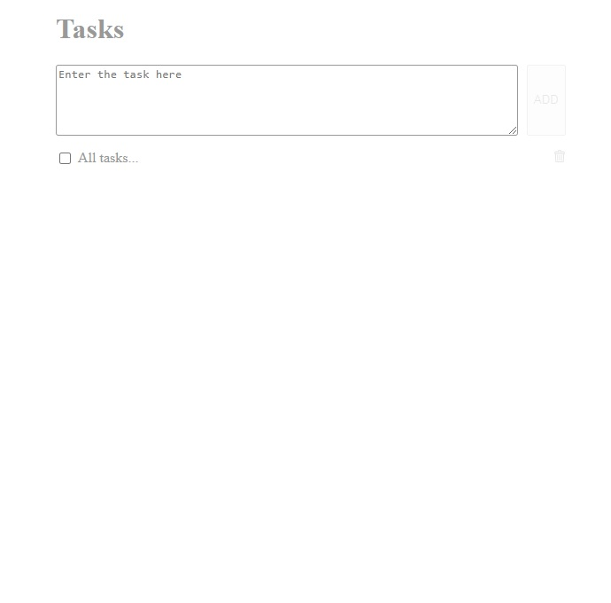

# tasks   

Simpe tasks manager, that is build on Vue.js!  
Use localStorage for save data and load when open page in another day.   
You can see the result at this [link](https://andrewmaksimchuk.github.io/tasks/)!   
   
